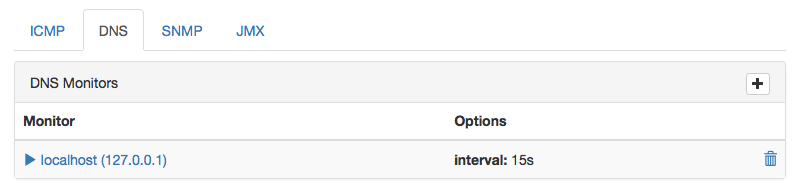
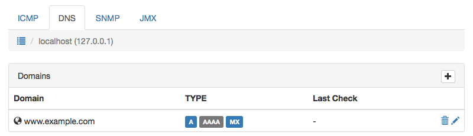

DNS Monitor
-----------
The DNS Monitor can be used to monitor a DNS server and guard
it's responses. It executes the `dig` command to retrieve specific
information about a DNS record and stores those results with
associated items.

Create a new DNS Monitor
^^^^^^^^^^^^^^^^^^^^^^^^
.. image:: images/dns_monitor_add.png

Delete an DNS Monitor
^^^^^^^^^^^^^^^^^^^^^^
.. image:: images/dns_monitor_delete.png

Check Monitored DNS domains
^^^^^^^^^^^^^^^^^^^^^^^^^^^

Add Monitored DNS domain
^^^^^^^^^^^^^^^^^^^^^^^^^^^
.. image:: images/dns_monitor_domain_add.png
