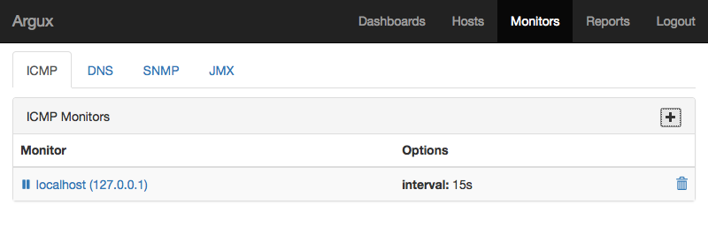
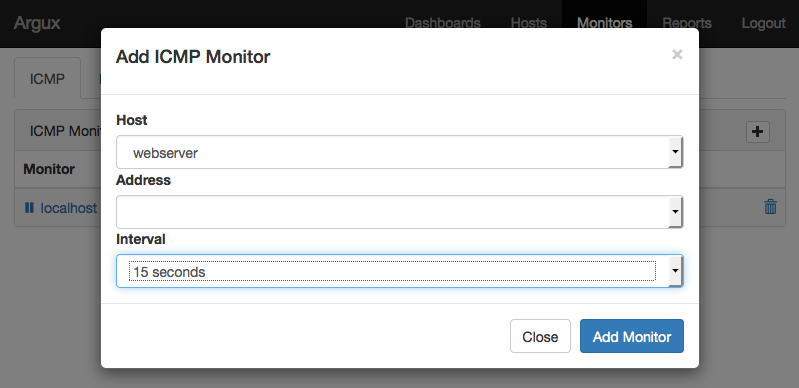
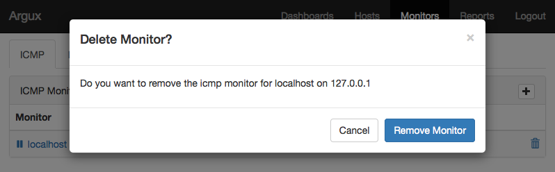

ICMP Monitor
------------
The ICMP Monitor executes the `ping` command and performs an
ICMP echo request to a specified host-address. The results of
this command are stored in items associated with this host.

Create a new ICMP Monitor
^^^^^^^^^^^^^^^^^^^^^^

Delete an ICMP Monitor
^^^^^^^^^^^^^^^^^^^^^^
A monitor can be deleted by clicking on the ``trashcan`` icon on the right.
.. NOTE::
   Consider pausing a monitor instead by clicking on the ``pause`` button on the right.

